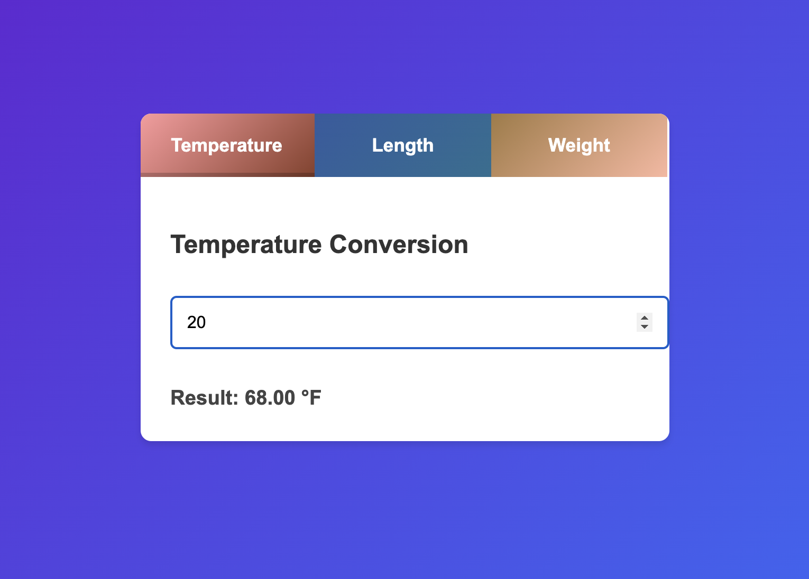

Day 6: Unit Conversion Tool

This project is a simple **Unit Conversion Tool** built with HTML, CSS, and JavaScript. Users can convert between:
- Temperature (Celsius to Fahrenheit)
- Length (Meters to Feet)
- Weight (Kilograms to Pounds)

Each type of conversion is displayed in a separate tab for an organized user experience.

## Features
- **Interactive Tabs**: Switch between Temperature, Length, and Weight conversion tabs.
- **Real-time Conversion**: Users input a value, and the result updates instantly.
- **Modern Design**: Styled with a visually appealing gradient background and vibrant tab colors.
- **Responsive Design**: Works seamlessly across various device sizes.

---
# Demo page
Click [Here](https://ayshasanyang.github.io/Day-6-Unit-Conversion-Tool/) to view the page
---

## 🚀 How to Run
1. Download or clone the repository
```bash
git clone https://github.com/ayshasanyang/Day-6-Unit-Conversion-Tool.git
```
2. Navigate to the project folder.
3. Open the project files in your vscode or any code editor of your choice
4. Open the `index.html` file in your web browser.

## How to Use
1. Launch the application by opening `index.html` in your browser.
2. Click on the desired conversion tab (Temperature, Length, or Weight).
3. Enter a value in the input box.
4. View the converted result displayed instantly below the input.

## Technical Details
### Conversion Formulas:
- **Temperature**: 
  \[ \text{Fahrenheit} = (\text{Celsius} \times \frac{9}{5}) + 32 \]
- **Length**:
  \[ \text{Feet} = \text{Meters} \times 3.28084 \]
- **Weight**:
  \[ \text{Pounds} = \text{Kilograms} \times 2.20462 \]

---

## 🛠️ Technologies Used
- **HTML** for structure
- **CSS** for styling and animations
- **JavaScript** for interactivity

---
## Future Enhancements
- Add reverse conversions (e.g., Fahrenheit to Celsius).
- Include more unit types (e.g., Volume, Area).
- Enhance animations for tab transitions.
---
### 📸 Preview


---

## 📢 Connect
If you enjoyed this project, let me know! Follow me on social media to see more coding content:
- Instagram: [@codewithaysha](#)
- TikTok: [@Aysha](#)

---
